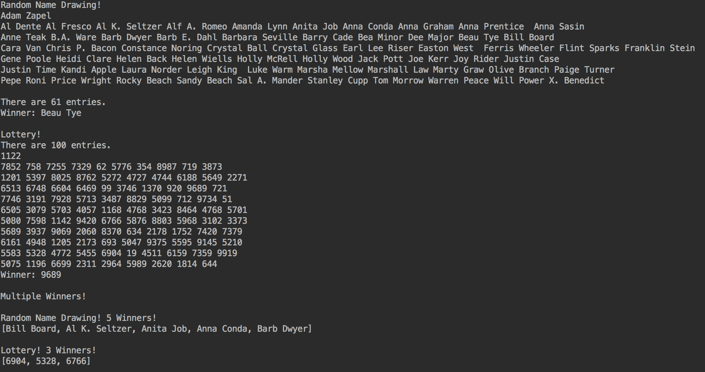

# Generic-Demonstration

Create a class that can be used to simulate a raffle-like drawing of objects, regardless of their type

## Requirements

### Part 1: Write the generic class called 'RandomBox'
- [x] Write the full class using generics
- [x] Include the following methods:
   - [x] A constructor
   - [x] void addItem(T newItem)
   - [x] T drawWinner()
   - [x] void displayEntries()
   - [x] String toString()
   
### Part 2: Add a generic method to the driver program
  - [x] Write a static generic method in the driver program to pick multiple winners from a RandomBox
    - [x] The method should declare a generic type
    - [x] The return type is a generic ArrayList
    - [x] The parameters are a RandomBox<T> object and the number of winners.

